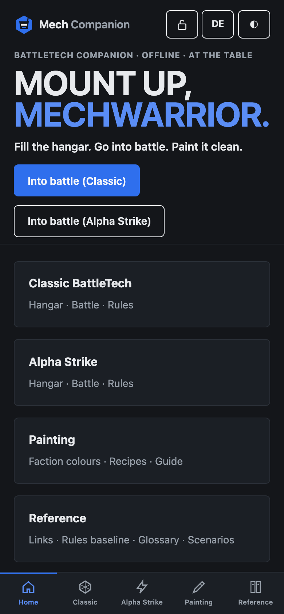
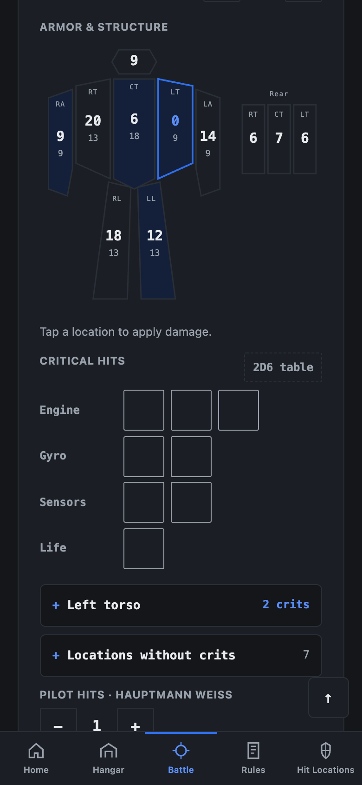
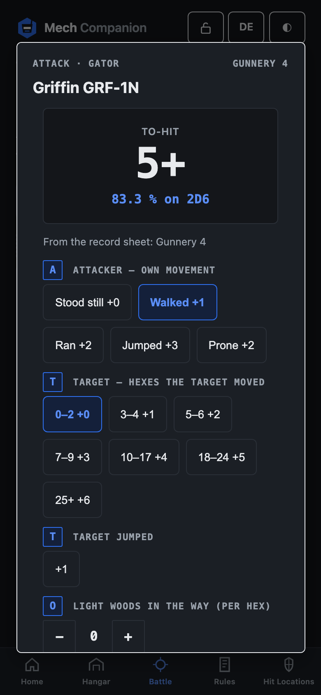
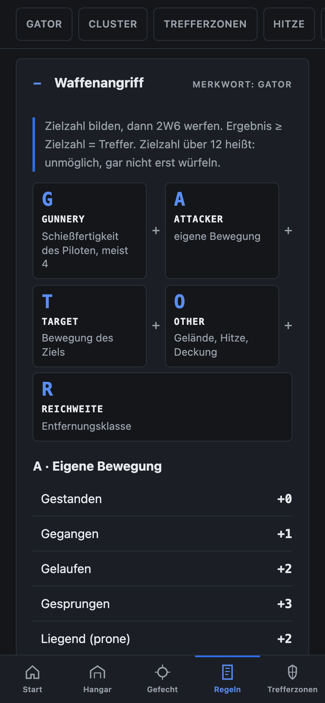
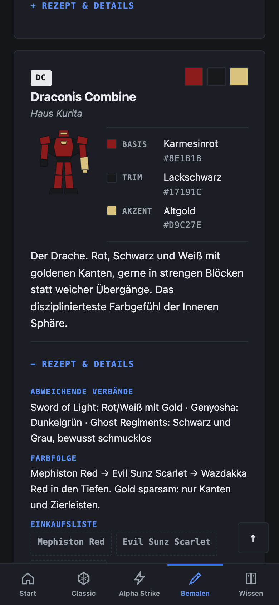

# Mech Companion

An offline-first companion app for tabletop **BattleTech** — rules reference,
play aids and a painting guide for **Classic BattleTech** and **Alpha Strike**.
Built to lie next to the table on a phone: dark by default, big touch targets,
and everything works with the network switched off.

Static HTML, CSS and vanilla JavaScript. No framework, no build step for the
app itself, no backend, no accounts, no tracking, no third-party requests at
runtime. Everything you save stays in your browser.

The app grew up in German and was turned inside out for release: English is
the source language now, German is the first language pack, and everything
personal about the instance it was written for lives outside this repository.
How that was done is in [`docs/history/`](docs/history/).

## Try it

**→ [herrbarmann.github.io/mech-companion](https://herrbarmann.github.io/mech-companion/)**

A neutral build of `main`, published from this repository on every push — same
app, project branding instead of an instance's, English as the start language.
Install it from the browser menu and it works from the home screen, offline.

<table>
<tr>
<td></td>
<td></td>
<td></td>
<td></td>
<td></td>
</tr>
<tr>
<td align="center"><sub>Home</sub></td>
<td align="center"><sub>Battle tracker</sub></td>
<td align="center"><sub>Attack</sub></td>
<td align="center"><sub>Rules · <i>de</i></sub></td>
<td align="center"><sub>Painting · <i>de</i></sub></td>
</tr>
</table>

## What it does

**Hangar** — pick units from a database of 4 000+ BattleMechs plus 3 300
vehicles, infantry, battle armor and ProtoMechs (armor, weapons, crit slots and
Alpha Strike card values arrive filled in), or enter your own.

**Battle tracker** — the digital record sheet. Armor and structure as tappable
pips on a paper doll, heat with plain-language effects, crit slots wired to the
weapons they destroy, an attack dialog that computes the to-hit number (GATOR
for Classic, SATOR for Alpha Strike) and rolls 2D6 against it, cluster hits
resolved on the table, hit locations rolled per group, ammo tracked, initiative,
round counter and an end-phase checklist.

**Campaigns** — damage survives the end of a battle. Named campaigns keep
per-unit condition and a battle log; a workshop screen repairs item by item.

**Print** — record sheets (Classic) and four unit cards per A4 page (Alpha
Strike) straight from your hangar, or "save as PDF" from the print dialog.

**Painting guide** — faction color schemes with hex values and paint recipes,
a step-by-step guide, technique reference, a scheme workshop with live preview
and a Citadel ↔ Vallejo ↔ Army Painter conversion table.

**Knowledge** — a German ↔ English glossary, a Classic/Alpha Strike comparison,
eras and scenarios.

## Run it locally

```bash
python3 tools/opensource/build.py && python3 -m http.server -d dist 8337
```

Then open <http://localhost:8337>. Service workers need a secure context, and
`localhost` counts as one, so offline mode and installing the app both work.

The build step fills in `{{site.…}}` placeholders (name, imprint, privacy
details) from `site.default.json`; see *Running your own instance* below.

## Offline

The app is a PWA: install it from the browser menu and it sits on the home
screen like an app. The service worker precaches the pages, scripts, styles
and rule data under a version that is counted up on every deploy; navigation
is network-first with a short timeout, so a fresh deploy shows up immediately.

Unit data is different. Twelve thousand files are not precached — a unit file
and its icon land in a second, lasting cache when you look at that unit, and
that cache survives app updates. So: browse your own 'Mechs once at home, and
the hangar works in flight mode at the table.

Everything you save — hangar, battles, campaigns, paint schemes — stays in
your browser (`localStorage`, photos in IndexedDB). There is no account and
no server to sync with, which also means: **export a backup now and then**.
The hangar page has the button, and it reminds you if it has been a while.

## Repository layout

| Path | What |
|---|---|
| `website/` | the app: pages, `js/`, `css/`, `data/`, generated unit data and icons |
| `tools/` | local tooling: data converters, the translation generator, checks and the deploy build |
| `design-system/` | the look documented, plus a preview page of every part |
| `docs/` | architecture, data pipeline, i18n, rule sources |
| `tests/` | `node:test` suite: the maths, the campaign, the language mechanism, the migrations |
| `site.default.json` | default configuration (name, imprint fields) used by the build |

## Data pipeline

Unit data is **derived**, not hand-written, and regenerating it is part of the
project:

```bash
# 1. MegaMek unit files (sparse checkout, ~50 MB of MTFs plus unit icons)
git clone --depth 1 --filter=blob:none --sparse https://github.com/MegaMek/mm-data.git
cd mm-data && git sparse-checkout set data/mekfiles/meks data/images/units && cd ..

# 2. MekBay's generated database (Alpha Strike card values, BV, equipment)
curl -sH "Accept-Encoding: gzip" https://db.mekbay.com/units.json | gunzip > mekbay-units.json
curl -sH "Accept-Encoding: gzip" https://db.mekbay.com/equipment2.json | gunzip > mekbay-equipment.json

# 3. Convert
python3 tools/convert-mtf.py ./mm-data ./mekbay-units.json        # BattleMechs
python3 tools/convert-as-units.py ./mm-data ./mekbay-units.json   # vehicles, infantry, BA, ProtoMechs
```

Afterwards bump both `VERSION` and the units cache name in `website/sw.js`,
otherwise browsers keep serving the old data. Details in `docs/DATA.md`.

## Languages

English is the source. Every other language is a pack under `tools/i18n/<code>/`,
and from it the generator builds a complete mirror of the site
(`website/de/` and so on) plus a runtime dictionary. Shipping today: English
and German.

```bash
python3 tools/translate.py          # regenerate, report the gaps
python3 tools/translate.py --check  # check only, exit 1 while anything is open
```

Anything without a translation stays in English and is listed in
`tools/i18n/<code>/_missing.json` — nothing breaks, it just shows. Adding a
language is five steps and no code: [`docs/I18N.md`](docs/I18N.md).

## Rules are fan summaries

The rule pages paraphrase the published rulebooks (Total Warfare, BattleMech
Manual, Alpha Strike: Commander's Edition) for private play. They are not
official rules and replace neither the books nor the errata. Where a value came
from a secondary source rather than the book, the page says so. Check against
your own copy before it decides a game.

Which value comes from which book — and which parts are community data — is
listed in [`docs/RULES-SOURCES.md`](docs/RULES-SOURCES.md). Found a deviation?
That is the most welcome kind of issue here; bring the book and the page.

## Running your own instance

The repository is deliberately neutral: no operator data, no branding. To run
your own instance, create a `site/` folder (git-ignored):

```
site/site.json              copy of site.default.json with your values
site/overlay/**             files copied over website/ (logo, icons, the two local stylesheets)
site/private-patterns.txt   regexes that must never appear in the repo
```

`python3 tools/opensource/build.py` produces `dist/` from `website/` plus your
configuration and overlay. `deploy.sh` builds and mirrors `dist/` to an FTP
webspace (credentials in `.env`, see `.env.example`).

Two stylesheets carry the look of an instance, and both are empty in the
repository — every page loads them last:

| File | For |
|---|---|
| `css/tokens.local.css` | colours and measurements; `--accent-deep` must reach 4.5:1 against `--paper` |
| `css/style.local.css` | everything else: own rules, background shapes, wordmark treatment, animation |

Drop your versions into `site/overlay/css/` and the build puts them over the
empty ones. The project itself stays plain — cards, clear tables, one accent —
so an instance can look as much like itself as it wants without touching
`website/css/`. See [`design-system/README.md`](design-system/README.md) and
its preview page.

## Checks

```bash
python3 tools/opensource/check.py   # six checks over the repository
node --test tests/*.test.js       # the maths and the stored data
```

`check.py` validates the JSON data, the service worker precache list,
translation completeness and JavaScript syntax, and makes sure that no
private pattern and no unfilled placeholder leaked into the repository. The
test suite covers the to-hit calculation against the real configurations, the
cluster table, range bands, the campaign state, the language mechanism and
every migration of stored data.

Both run in CI on every push and pull request, together with three things a
laptop forgets more easily: that the generated mirrors are up to date, that
the precache list matches the file tree, and that every old address still has
its redirect.

## Documentation

| Document | What is in it |
|---|---|
| [`docs/ARCHITECTURE.md`](docs/ARCHITECTURE.md) | the three layers, where state lives, offline, build and overlay |
| [`docs/DATA.md`](docs/DATA.md) | curated versus derived data, the pipeline, the sources and their licence |
| [`docs/I18N.md`](docs/I18N.md) | adding a language in five steps |
| [`docs/RULES-SOURCES.md`](docs/RULES-SOURCES.md) | which rule value comes from which book |
| [`docs/CONCEPT.md`](docs/CONCEPT.md) | the original design document — why things are the way they are |
| [`CHANGELOG.md`](CHANGELOG.md) | what changed per release, and what an update does to stored data |
| [`docs/history/`](docs/history/) | how the app was taken from German to English for release |

## Contributing

Issues and pull requests are welcome — especially rule corrections (please cite
the book and page), language packs, and unit data problems. Start with
[`CONTRIBUTING.md`](CONTRIBUTING.md); it lists the checks to run and the
handful of constraints that are not negotiable.

What is planned but unbuilt is filed under the
[`roadmap`](https://github.com/HerrBarmann/mech-companion/labels/roadmap) label,
straight out of the design document. Two of them are a good place to start:
a [weapons quick reference](https://github.com/HerrBarmann/mech-companion/issues/8)
and a [falling damage calculator](https://github.com/HerrBarmann/mech-companion/issues/9).
If you play BattleTech in a language this app does not speak yet, there is
[an issue for that too](https://github.com/HerrBarmann/mech-companion/issues/10).

## License

Mech Companion by **Dennis Bormann**, licensed under
[**CC BY-NC-SA 4.0**](https://creativecommons.org/licenses/by-nc-sa/4.0/) —
see [`LICENSE`](LICENSE).

Share it, run it, fork it, translate it. Name the author and link back, keep it
non-commercial, and pass changes on under the same terms. One license covers the
code, the data and the written content alike: the unit database is derived from
[MegaMek mm-data](https://github.com/MegaMek/mm-data) and
[MekBay](https://github.com/MegaMek/mekbay), which are CC BY-NC-SA themselves,
and the rule pages paraphrase published rulebooks for private play — a
commercial use of this project was never there to give away.
[`NOTICE.md`](NOTICE.md) has the short version and the reasoning,
[`LICENSE-DATA.md`](LICENSE-DATA.md) records what came from where and how to
attribute it, and bundled third-party code keeps its own terms, see
[`THIRD-PARTY.md`](THIRD-PARTY.md).

MechWarrior, BattleMech, 'Mech and BattleTech are registered trademarks of
The Topps Company, Inc. Catalyst Game Labs is the licensee. This is an
unofficial fan project, not affiliated with The Topps Company, Catalyst Game
Labs or the MegaMek Team.
